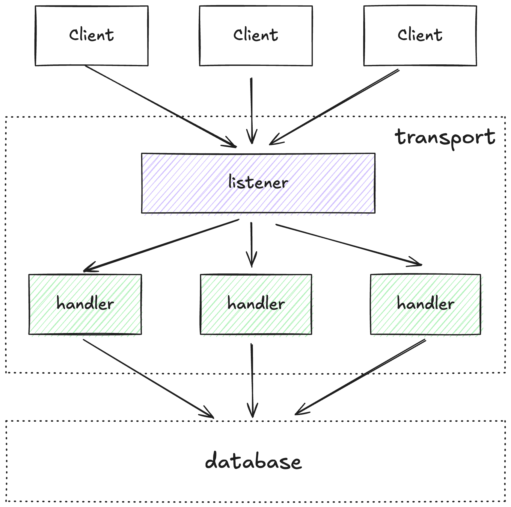

# Redis-go

## 系统特性

- 借鉴 C 语言版 redis 的单线程操作数据库模型，避免了加锁开销
- 尽可能复用频繁创建销毁的对象，减轻 GC 压力

## 核心架构组件

### 1. 传输层（transport）

- 使用 TCP 服务器监听连接
- 实现 Redis 协议（RESP-Redis Serialization Protocol）解析
- 连接池管理和并发处理
- ……

### 2. 命令解析器

- RESP协议解析器，处理客户端请求
- 命令路由和分发
- 参数验证和类型检查
- ……

### 3. 命令执行器

- 各种 Redis 命令的具体实现
- ……

### 4. 数据存储引擎

- 无锁 key-value 缓存
- 内存数据结构实现（字符串、哈希、列表、集合、有序集合）
- 过期键管理
- 持久化机制（RDB快照、AOF日志）
