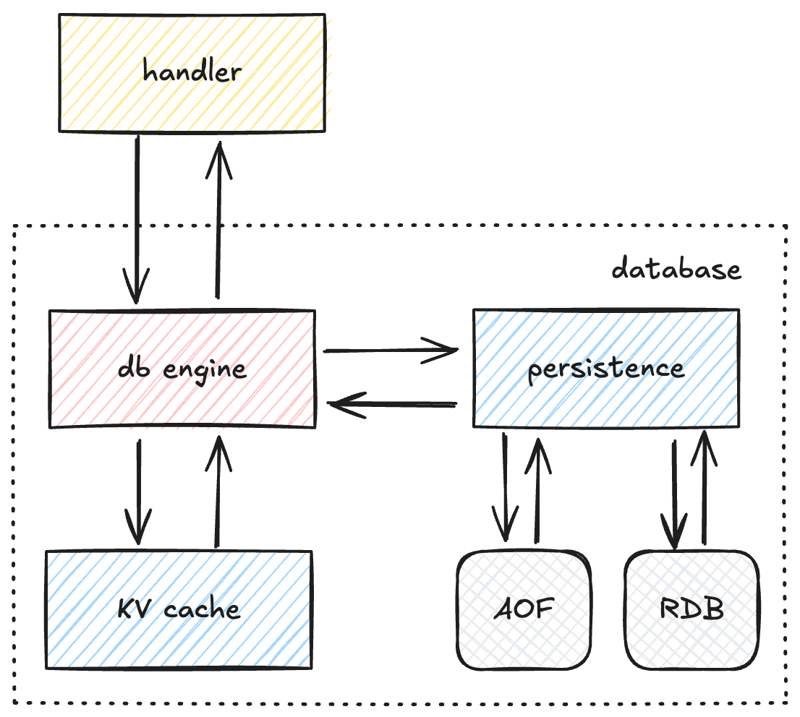

# Redis-go

## 系统特性

- 实现事务原子性，在执行出错时回滚已执行命令
- 尽可能复用频繁创建销毁的对象，减轻 GC 压力
- 使用 Raft 协议维护集群元数据

## 核心架构组件

### 1. 传输层（transport）

- 使用 TCP 服务器监听连接
- 实现 Redis 协议（RESP-Redis Serialization Protocol）解析
- 连接池管理和并发处理

### 2. 数据库引擎

- 核心服务向传输层暴露的接口，向传输层 Handler 提供 `Exec` 接口执行 Redis 命令
- 命令路由和分发
- 参数验证和类型检查
- 持久化注册与管理
- 集群通信与状态维护

### 3. 持久化工具

- 向数据库引擎提供持久化方法
- 加载、写入 AOF 日志和 RDB 快照

### 4. KV 缓存

- key-value 缓存，实现 LRU、LFU 等淘汰策略
- 过期键管理
